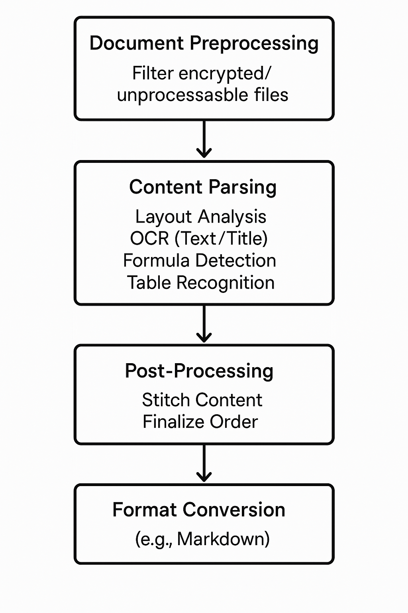

# PDF Processing Pipeline

## 1. Document Preprocessing
- Read PDF files
- Filter out unprocessable files (e.g., encrypted)

## 2. Document Content Parsing
- **Layout analysis**:
  - Detect document layout
  - Identify formulas, images, table, text
- **Apply specialized recognizers**:
  - OCR for text and titles
  - Formula recognition
  - Table extraction

## 3. Document Post-Processing
- Remove invalid regions
- Stitch content based on positioning information
- Finalize content order and structure

## 4. Format Conversion
- Generate output in required formats:
  - Markdown (default)
  - Other user-specified formats

