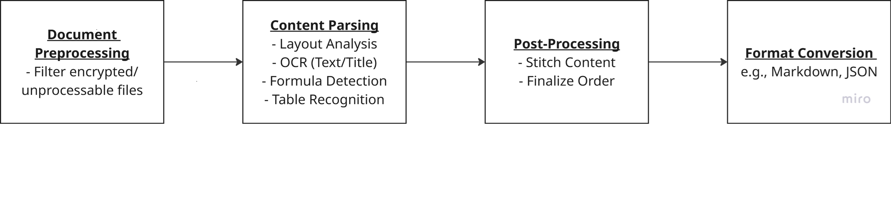

# PDF Processing Pipeline

This document outlines the sophisticated pipeline for processing PDF documents into structured, accessible formats using multi-model AI processing.

## 1. Document Preprocessing

### Input Handling
- **PDF File Ingestion**:
  - Support for single and multi-page PDFs
  - Large file handling with streaming capabilities
  - Batch processing support

### Validation & Filtering
- **Document Validation**:
  - Check for file integrity and format compliance
  - Detect and handle encrypted documents
  - Verify PDF version compatibility

### Resource Allocation
- **Memory Management**:
  - Efficient page buffering
  - Resource optimization for large documents
  - Parallel processing preparation

## 2. Document Content Parsing

### Layout Analysis
- **Structural Detection**:
  - Page segmentation and region identification
  - Content flow analysis
  - Hierarchical document structure mapping

### Element Recognition
- **Content Type Detection**:
  - Text blocks and paragraphs
  - Headers and footers
  - Lists and bullet points
  - Tables and grids
  - Mathematical formulas
  - Images and diagrams
  - Code blocks and snippets

### Specialized Processing
- **OCR Integration**:
  - Text extraction from images
  - Character recognition and verification
  - Multi-language support

- **Formula Recognition**:
  - Mathematical expression parsing
  - LaTeX conversion
  - Symbol and operator identification

- **Table Extraction**:
  - Grid structure analysis
  - Cell content recognition
  - Header/data relationship mapping

## 3. Document Post-Processing

### Content Refinement
- **Region Validation**:
  - Remove duplicate or invalid regions
  - Handle overlapping content
  - Resolve content conflicts

### Content Organization
- **Structural Assembly**:
  - Position-based content stitching
  - Logical flow reconstruction
  - Cross-reference resolution

### Quality Assurance
- **Content Verification**:
  - Format consistency checks
  - Content completeness validation
  - Structure integrity verification

## 4. Format Conversion

### Output Generation
- **Primary Format**:
  - Markdown conversion with extended syntax
  - Rich text formatting preservation
  - Image and table handling

### Alternative Formats
- **Format Options**:
  - HTML with CSS styling
  - Plain text with structure markers
  - Custom format templates

### Optimization
- **Output Enhancement**:
  - Minification options
  - Accessibility improvements
  - SEO-friendly structuring

## Multi-Model AI Processing

The pipeline employs sophisticated layout analysis to identify and process different element types within the document. Each element type triggers specialized AI model processing:

### Text Processing
- GPT-4 for context understanding
- Claude AI for technical content
- Mistral AI for quick text analysis

### Visual Elements
- Vision models for image analysis
- Specialized OCR for complex layouts
- Table structure recognition

### Mathematical Content
- Formula parsing models
- Symbol recognition
- LaTeX conversion accuracy

This multi-model approach ensures optimal processing for each content type, maintaining high accuracy and fidelity in the final output.